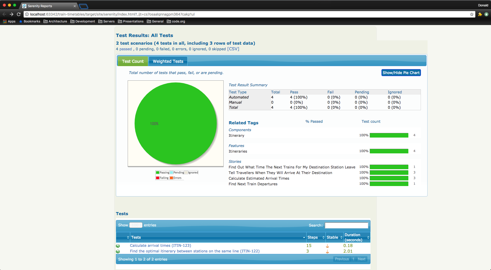
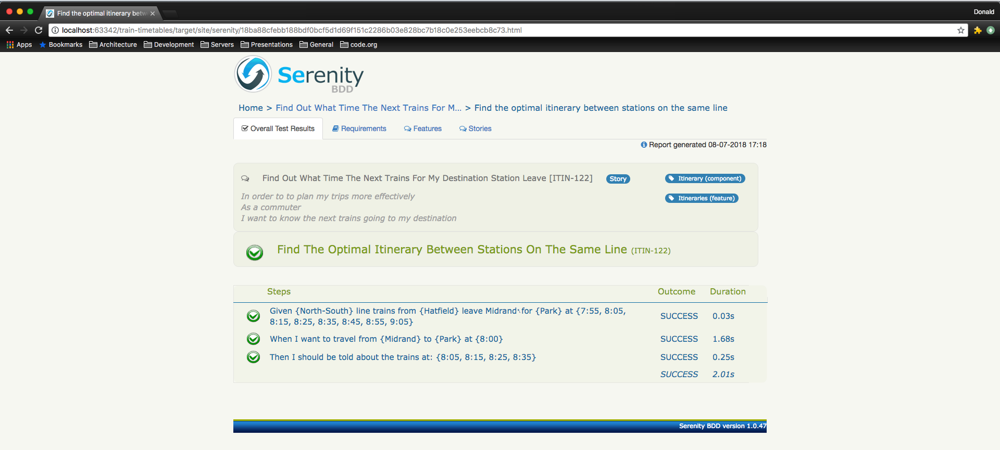
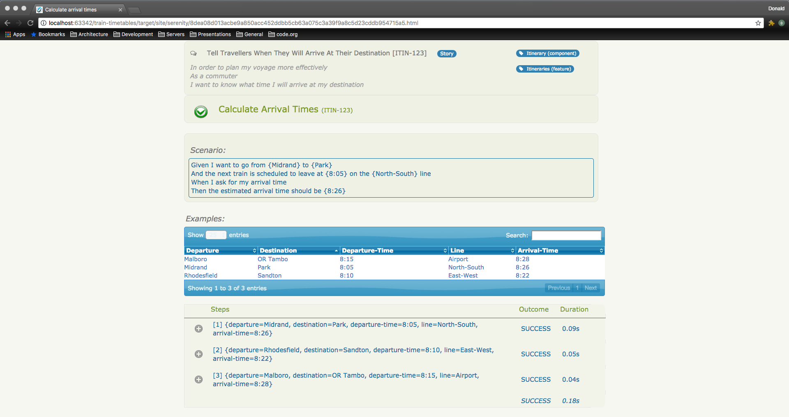

# Acceptance Tests
To run the _Acceptance Test Suite_, type the following in command line:
```bash
mvn -P acceptance-tests clean verify
```

## Acceptance Test Reports
After the build has run, the Acceptance Test reports can be found in _target/site/serenity_. Use a browser to view the _index.html_ file.

### Test Results Page

### Find the Next Train Departure Time Story

### Calculate Arrival Times Story
